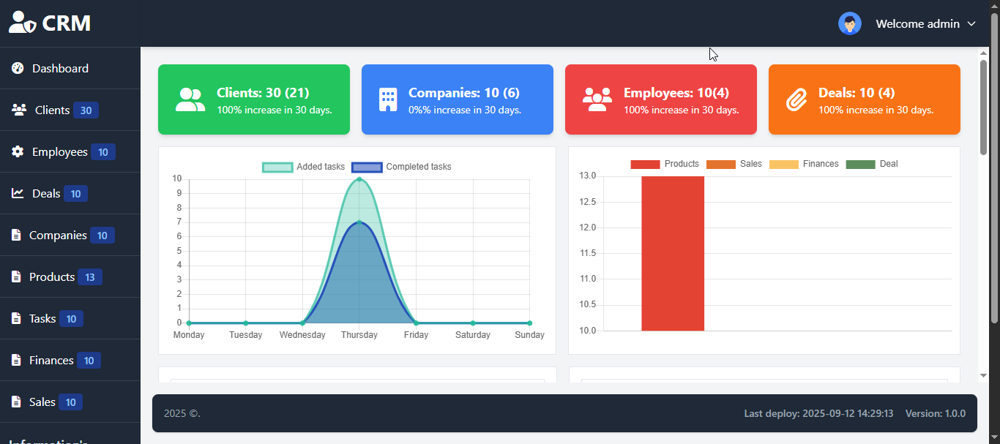

# CRM System — Built with Laravel 11 & PHP 8.2+


This CRM system is a scalable business management solution designed to support B2B operations, automate workflows, and improve client relationship management.  
It provides a centralized platform to monitor leads, manage financial activity, and generate insights for informed decision-making.

---

## 📌 Project Overview

The project began on **August, 2025**, and has evolved significantly through continuous improvements, modernization, and feature expansion.

Your feedback, contributions, or suggestions are highly appreciated.

<p align="center">
  
</p>

---

## ⚙️ System Capabilities

### 🧩 Core Modules
- 👤 Client data management & interaction tracking  
- 🧑‍💼 Employee account control and role-based access  
- 🏢 Company and internal structure administration  
- 📑 Contract lifecycle management with partner organizations  

### 📈 Marketing & Workflow
- 📦 Product catalog & offer management  
- 📋 Task assignment system with progress monitoring  

### 💼 Sales & Finance
- 💳 Transaction and finance tracking  
- 📌 Lead management, deal flow tracking, and performance analysis  

### 📊 Reporting & Analytics
- Real-time KPI dashboards (Daily / Weekly / Monthly / Yearly)
- Full activity logs and operational summaries  

> 🔧 The project is still in active development with planned upgrades and additional modules.

---


```bash
git clone https://github.com/aymenmehdid22/crm-system.git
